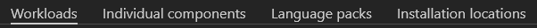
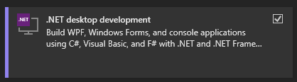
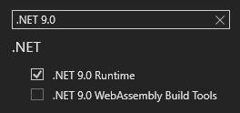
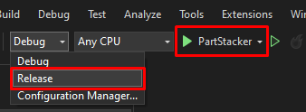

# Build and run PartStacker on Windows

## Requirements

### Install `git`

* Visit https://git-scm.com/downloads/win
* In most cases, the link _"64-bit Git for Windows Setup"_ is the correct download link

To see if `git` is installed

* Open Windows PowerShell
* Type `git --version`
* If you see the output "`git version 2.47.1.windows.2`", or some variation, then it worked
* If you see something along the lines of "`git : The term 'git' is not recognized as the name of a cmdlet, ...`" then it didn't work
    * Either close and reopen PowerShell
    * Or try installing again

### Install Visual Studio 2022 Community Edition

* If you don't have Visual Studio 2022 yet, visit [this download link](https://visualstudio.microsoft.com/thank-you-downloading-visual-studio/?sku=Community&channel=Release&version=VS2022) for the installer
* If you already have Visual Studio 2022, open the Visual Studio Installer already on your computer
    * Ensure you have at least version 17.8
    * The screenshot below shows version 17.12, which is higher than 17.8
    * 
    * Otherwise, update Visual Studio to a new enough version
    * 
    * Then click "Modify"

You should see 4 tabs in this window



* In the "Workloads" tab, make sure you select ".NET desktop development"
* 
* In the "Individual components tab, make sure you search for and select ".NET 8.0 Runtime"
* 

Then click install at the bottom right

* It may require that you reboot your computer

## Grab the code

Open Windows PowerShell

* You will be likely be located at the "`C:\Users\{your-username}`" directory
    * Fill in "`{your-username}`" with your actual username
* Navigate to whichever directory you would like to put the PartStacker code into, using the `cd` command
* For example, if you wanted to put the code into "Documents", you would type `cd C:\Users\{your-username}\Documents`
* At this point, the next PowerShell line will have the directory you chose, followed by a `>` symbol with a blinking cursor.

Type the following command, and wait for it to finish

```
git clone --recurse-submodules --jobs 8 https://github.com/PartStackerCommunity/PartStacker.git
```

After this, you will have a new folder called "PartStacker" in the current directory.

* For example, if you chose to use the "Documents" folder, you would now have a new folder at `C:\Users\{your-username}\Documents\PartStacker`
* This directory will be referred to as the "PartStacker directory" or the "PartStacker folder"

## Ensure the code is up to date

If you already had the code downloaded from before, open Windows PowerShell, navigate to the PartStacker directory, and type the following commands one at a time

```
git checkout main
git pull
```

## Build and run PartStacker

Go into the PartStacker folder in your regular file explorer, then open `PartStacker.sln` in Visual Studio 2022

* If a dropdown near the top of the window says "Debug", click it to select "Release"
* Click the solid green arrow at the top, to build and run PartStacker
* 
* If all goes well, PartStacker will build and immediately start running

If you make edits to the code, click the solid green arrow again to rebuild and rerun PartStacker
