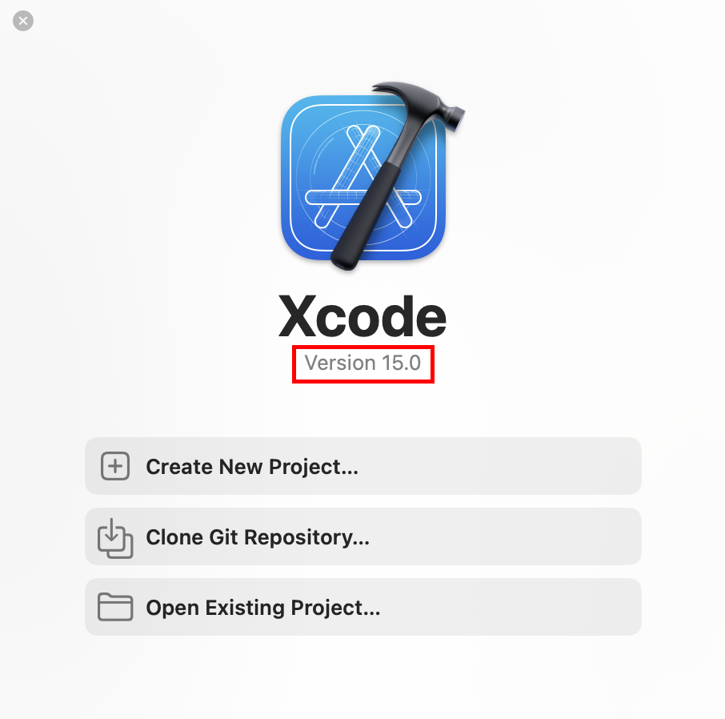

# Build and run PartStacker on MacOS

**Please note**, this process can be quite involved. Browse through the full instructions before starting, to know whether this is something you want to do.

## Requirements

### Install CMake

* Visit https://cmake.org/download/
* Any download link on this page with "macos-universal" should work fine

To see if CMake is properly installed

* Open Terminal
* Type `cmake --version`
* If you see the output "`cmake version 3.30.8`", or some variation, then it worked
* If you see something that looks like "`command not found: cmake`" then it didn't work
    * Either close and reopen Terminal
    * Or try installing again

### Install Xcode

* If you don't have Xcode yet, visit [this download link](https://apps.apple.com/us/app/xcode/id497799835/) or install it from the Mac App Store
* If you already have Xcode, open it
    * Ensure you have at least version 15.0
    * 

### Ensure `git` is installed

According to [their own Mac download page](https://git-scm.com/downloads/mac), "Apple ships a binary package of Git with Xcode"

* Open Terminal
* Type `git --version`
* If you see the output "`git version 2.47.1 ...`", or some variation, then it worked
* If you see something that looks like "`command not found: cmake`" then it didn't work
    * Either close and reopen Terminal
    * Or try another method for downloading on [their Mac download page](https://git-scm.com/downloads/mac)

## Grab the code

Open Terminal

* You will be likely be located at the "`~`" directory, which is the "home directory" for your user profile
* Navigate to whichever directory you would like to put the PartStacker code into, using the `cd` command
* For example, if you wanted to put the code into "Documents", you would type `cd ~/Documents`

Type the following command, and wait for it to finish

```
git clone --recurse-submodules --jobs 8 https://github.com/PartStackerCommunity/PartStacker.git
```

After this, you will have a new folder called "PartStacker" in the current directory.

* For example, if you chose to use the "Documents" folder, you would now have a new folder at `~/Documents/PartStacker`
* This directory will be referred to as the "PartStacker directory" or the "PartStacker folder"

## Ensure the code is up to date

If you already had the code downloaded from before, open Terminal, navigate to the PartStacker directory, and type the following commands one at a time

```
git checkout main
git pull
git submodule update --recursive
```

## Build and run PartStacker

### Build PartStacker

* Open Terminal
* Navigate to the PartStacker directory
* Type `cmake --preset Release -G Xcode`, and wait for it to finish
* Then type `cmake --build --preset Release`, and wait again
* The first time you build, both of these commands will take longer

If you choose to make edits to the code, repeat these steps to rebuild PartStacker

* Make sure you've exited PartStacker before building again

### Run PartStacker

After building, the PartStacker GUI will be in the PartStacker directory

* It will be located in `{PartStacker-directory}/bin`
* Navigate to that location in Finder
* Run the application!

If all goes well, PartStacker will run successfully
