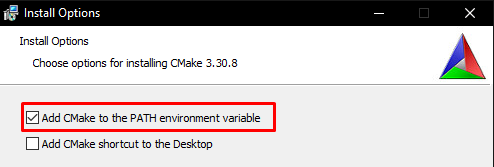
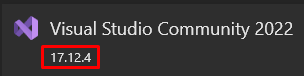
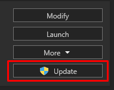
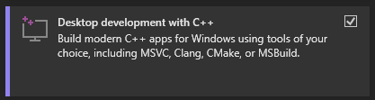
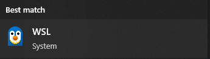

# Build and run PartStacker on Windows

**Please note**, this process can be quite involved. Browse through the full instructions before starting, to know whether this is something you want to do.

## Requirements

### Install `git`

* Visit https://git-scm.com/downloads/win
* In most cases, the link _"64-bit Git for Windows Setup"_ is the correct download link

To see if `git` is installed

* Open a new instance of Windows PowerShell
* Type `git --version`
* If you see the output "`git version 2.47.1.windows.2`", or some variation, then it worked
* If you see something along the lines of "`git : The term 'git' is not recognized as the name of a cmdlet, ...`" then it didn't work
    * Either close and reopen PowerShell
    * Or try installing again

### Install CMake

* Visit https://cmake.org/download/
* Any version on this page should work fine
* In the installer, ensure you select "Add CMake to the PATH environment variable"
* 

To see if CMake is properly installed

* Open a new instance of Windows PowerShell
* Type `cmake --version`
* If you see the output "`cmake version 3.30.8`", or some variation, then it worked
* If you see something along the lines of "`cmake : The term 'cmake' is not recognized as the name of a cmdlet, ...`" then it didn't work
    * Either close and reopen PowerShell
    * Or try installing again

### Install WSL (needed for `make` command)

This is a fairly heavyweight requirement for such a small usage, so hopefully it can be removed in the future

* Follow the instructions at https://learn.microsoft.com/en-us/windows/wsl/install

### Install Visual Studio 2022 Community Edition

* If you don't have Visual Studio 2022 yet, visit [this download link](https://visualstudio.microsoft.com/thank-you-downloading-visual-studio/?sku=Community&channel=Release&version=VS2022) for the installer
* If you already have Visual Studio 2022, open the Visual Studio Installer that's already on your computer
    * Ensure you have at least version 17.12
    * 
    * Otherwise, update Visual Studio to a new enough version
    * 
    * Then click "Modify"

You should see 4 tabs in this window


* In the "Workloads" tab, make sure you select "Desktop development with C++"
* 

Then click install at the bottom right

* It may require that you reboot your computer

## Grab the code

Open Windows PowerShell

* You will be likely be located at the "`C:\Users\{your-username}`" directory
    * Fill in "`{your-username}`" with your actual username
* Navigate to whichever directory you would like to put the PartStacker code into, using the `cd` command
* For example, if you wanted to put the code into "Documents", you would type `cd C:\Users\{your-username}\Documents`
* At this point, the next PowerShell line will have the directory you chose, followed by a `>` symbol with a blinking cursor.

Type the following command, and wait for it to finish

```
git clone --recurse-submodules --jobs 8 https://github.com/PartStackerCommunity/PartStacker.git
```

After this, you will have a new folder called "PartStacker" in the current directory.

* For example, if you chose to use the "Documents" folder, you would now have a new folder at `C:\Users\{your-username}\Documents\PartStacker`
* This directory will be referred to as the "PartStacker directory" or the "PartStacker folder"

## Ensure the code is up to date

If you already had the code downloaded from before, open Windows PowerShell, navigate to the PartStacker directory, and type the following commands one at a time

```
git checkout main
git pull --recurse-submodules
```

## Build and run PartStacker

### Configure the dependency GLEW

* Open WSL
* 
* Navigate to the PartStacker directory
    * Assuming your PartStacker directory is at `C:\Users\{your-username}\Documents\PartStacker`
    * Type in `cd /mnt/c/Users/{your-username}/Documents/PartStacker`
    * Note that the back slashes turned into forward slashes, and "C:" turned into "/mnt/c"
* After navigating to the PartStacker directory, type `cd external/glew/auto`
* Then type `make`
* Wait until it finishes
* Now you can close WSL

### Build PartStacker

* Open Windows PowerShell
* Navigate to the PartStacker directory
* Type `cmake . -B build`, and wait for it to finish
* Then type `cmake --build build`, and wait again
    * The first time you build, this will take a long time

If you choose to make edits to the code, repeat these steps to rebuild PartStacker

* Make sure you've closed out of the PartStacker if you have it running

### Run PartStacker

After building, the PartStacker GUI will be in the PartStacker directory

* It will either be located at `{PartStacker-directory}\build\src\pstack\gui\Debug\gui.exe` or at `{PartStacker-directory}\build\src\pstack\gui\Release\gui.exe`
* Navigate to that location in your regular file explorer or in Windows PowerShell
* Run the application!

If all goes well, PartStacker will run successfully
